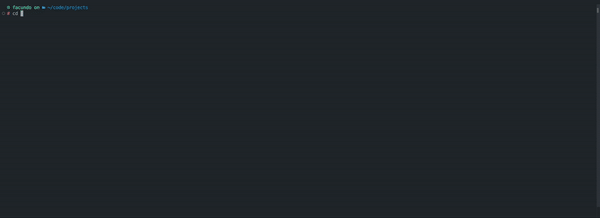

# Interactive File Remover - irm

This is a terminal-based interactive file and directory remover application. It allows you to navigate through your directory structure, select files or directories, and remove them using a terminal user interface (TUI).



## Features

- **Navigate**: Move up and down through directories and files.
- **Select**: Mark files or directories for removal.
- **Remove**: Delete selected files or directories.
- **Open Directories**: Expand directories to see their contents.
- **Clear**: Remove all selected files and directories.

## Keybindings

- **Move**: Use `Up` and `Down` arrow keys.
- **Open Directory**: Press `Enter`.
- **Select**: Press `Space`.
- **Remove Selected**: Press `R`.
- **Remove All**: Press `Ctrl + R`.
- **Quit**: Press `Q` or `Ctrl + C`.

## Installation

### Using Cargo

To use this application, ensure you have Rust installed. You can then clone this repository and run the application.

```bash
git clone https://github.com/Fluzko/irm
cd irm
cargo run
```

### Using Binary

You can also compile it and run it as a binary.

```bash
git clone https://github.com/Fluzko/irm
cd irm
cargo build --release
./target/release/irm
```

optional: you can move the binary to a directory in your PATH to run it from anywhere.

```bash
mv ./target/release/irm /usr/local/bin
cd some/other/directory
irm
```

## Dependencies

This project uses the following dependencies:

- [ratatui](https://crates.io/crates/ratatui) for the terminal user interface.
- [crossterm](https://crates.io/crates/crossterm) for handling terminal input events.

## Usage

Once the application is running, you can navigate through your file system and perform the following actions:

1. **Move**: Use the arrow keys to move through the list of files and directories.
2. **Select**: Press `Space` to mark a file or directory for removal.
3. **Open Directory**: Press `Enter` to expand a directory and view its contents.
4. **Remove**: Press `R` to remove the currently selected file or directory.
5. **Remove All**: Press `Ctrl + R` to remove all selected files and directories.
6. **Quit**: Press `Q` or `Ctrl + C` to exit the application.

## License

This project is licensed under the MIT License. See the [LICENSE](LICENSE) file for more details.

## Contributions

Contributions are welcome! Please open an issue or submit a pull request with your improvements or bug fixes.

## Author

This project was created by Facundo Luzko.
